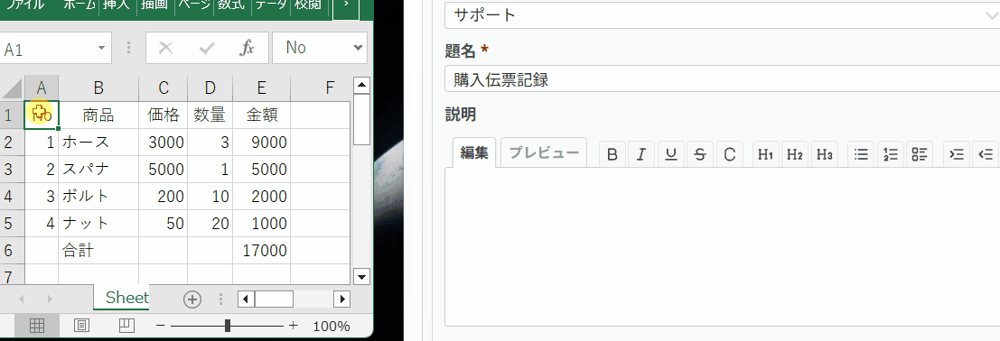

# Redmine Plugin Excel Markdown Paste

Redmineのチケットテキスト書式が Markdown（CommonMark）のとき、チケットの説明・コメントへ Excel のセル範囲を貼り付けると、Markdown の表として挿入できます。



画像の貼り付けはこのプラグインを通しません。Redmine 標準の `` のままです。Excel からコピーした図や `` は表から除外します。

## 動作

- 対象はチケット画面の説明、コメント、および同じ画面の Wiki 形式テキスト欄です。
- 管理画面のテキスト書式が Markdown のときだけ動きます。Textile や書式なしでは、いままでどおり貼り付けます。
- 複数セルをコピーした場合だけ表にします。1 セルだけのコピーは通常のテキストのままです。
- 先頭行を表の見出しにします。セル内の改行は `<br>`、`|` はエスケープします。
- コードブロック（\`\`\` または ~~~）の中では変換しません。

## ライセンス

Copyright 2026 kazuihitoshi@gmail.com

GNU General Public License version 2（またはそれ以降のバージョン）です。本文は `LICENSE` にあります。

## 導入

`plugins/redmine_excel_markdown_paste` に配置し、Redmine を再起動してください。

## Docker で試す

このディレクトリで次を実行します。Redmine のイメージは `6.1.2` に固定しています。

```
docker compose up
```

ブラウザで http://localhost:3000 を開きます。初回のデータベース作成には少し時間がかかります。初期の管理者は `admin` / `admin` です。

添付ファイル、ログ、プラグイン置き場、テーマ、データベースは `temp/` に保存します。このプラグインだけは、リポジトリ直下をコンテナの `plugins/excel_markdown_paste` にマウントします。
